# 100-days-of-Cloud-AWS-
This is my live portfolio for the **100 Days of Cloud** challenge.   I'm documenting each day's task with real AWS console screenshots.  I'll keep updating this README as I progress.

## Progress Overview
  

Completed all tasks up to Day 16. Below are the days I currently have screenshots for, shown in chronological order.

## Completed Tasks with Screenshots

### Day 3: Create Subnet
  

Created a new custom subnet (`devops-subnet`) in my VPC with CIDR 172.31.128.0/20.

**Learnings:** Subnets allow logical isolation of resources, control traffic flow, and placement in specific Availability Zones.

### Day 8: Enable Stop Protection for EC2 Instance
  

Enabled stop protection on a running EC2 instance to prevent accidental stopping.

**Learnings:** Stop protection is a safeguard against unintended downtime caused by manual errors.

### Day 9: Enable Termination Protection for EC2 Instance
  

Enabled termination (deletion) protection on running instances.

**Learnings:** Critical for production — prevents irreversible deletion of important instances.

### Day 10: Attach Elastic IP to EC2 Instance
  

Associated a static Elastic IP (98.86.35.126) with my EC2 instance.

**Learnings:** Elastic IPs provide a fixed public IP that remains even after stop/start cycles — great for production services.

### Day 11: Attach Elastic Network Interface to EC2 Instance
  

Attached a secondary Elastic Network Interface (ENI) to the instance (noted t2.micro limitations on advanced features).

**Learnings:** ENIs enable multiple network connections per instance for advanced networking scenarios.

### Day 12: Attach Volume to EC2 Instance
  

Attached an additional EBS volume (`xfusion-volume`) to a running instance as `/dev/sdb`.

**Learnings:** You can expand storage on live instances without downtime.

### Day 13: Create AMI from EC2 Instance
  

Created a custom Amazon Machine Image (AMI) from a configured running instance.

**Learnings:** AMIs are reusable templates for launching identical, pre-configured instances quickly.

### Day 14: Terminate EC2 Instance
  

Safely terminated an instance after disabling protections (confirmed root volume deletion).

**Learnings:** Termination is permanent — always create AMIs or snapshots first for important data.

### Day 15: Create Volume Snapshot
  

Created a point-in-time snapshot of an EBS volume.

**Learnings:** Snapshots are incremental backups — cost-effective for data protection and recovery.

### Day 16: Create IAM User 
  

Created a new IAM user (`iamuser_john`) with console access, auto-generated password, and forced password reset on first login.

**Learnings:** Never use the root account for daily tasks. Use IAM users with least privilege, enable MFA, and enforce strong password policies.

### Day 17 - Created an IAM Group.

IAM Groups are containers that make it easier to manage permissions for multiple users at once. You attach policies to the group, then add users to it—so everyone in the group gets the same permissions without having to configure each user individually.

### Day 18: Create Read-Only IAM Policy for EC2 Console Access
Created a custom IAM policy with read-only permissions for EC2 console access (using the visual policy editor or JSON).

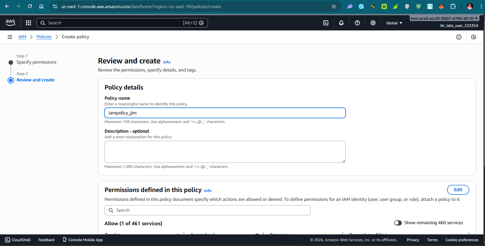  

Learnings:
Custom policies let you grant exactly the permissions needed. For read-only EC2 access, use actions like ec2:Describe*, ec2:Get*, and ec2:List* with Effect: Allow and no write/delete actions. This follows the principle of least privilege and is safer than attaching broad policies like AdministratorAccess.

### Day 19: Attach IAM Policy to IAM User
Attached the read-only EC2 policy (created on Day 18) directly to the IAM user (iamuser_john).

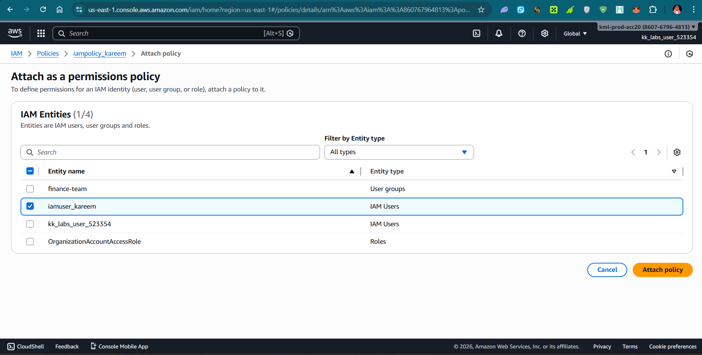

Learnings:
Policies can be attached directly to users, but this works best for one-off or temporary access. For better scalability, it’s usually recommended to attach policies to groups or roles instead. After attachment, the user should now have read-only visibility in the EC2 console without being able to modify anything.

### Day 20: Create IAM Role for EC2 with Policy Attachment
Created an IAM role for EC2 instances, selected the EC2 trusted entity, and attached a policy (e.g., AmazonS3ReadOnlyAccess or a custom one).

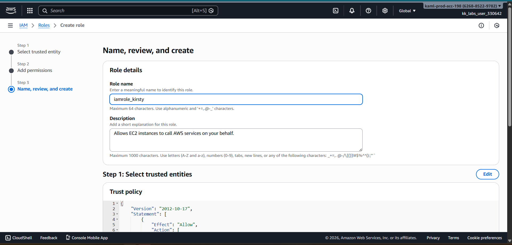

Learnings:
IAM roles are the preferred way to give permissions to AWS services (like EC2 instances). Unlike users, roles have no permanent credentials—instead, temporary credentials are provided via the instance metadata service. This is more secure than storing access keys on the instance. Once attached to an instance, applications running on it can use the role’s permissions automatically.

### Day 21: Setting Up an EC2 Instance with an Elastic IP for Application Hosting
Launched (or configured) an EC2 instance, associated an Elastic IP to it, and prepared it for hosting an application (e.g., updated security group for HTTP/SSH, installed necessary software).

   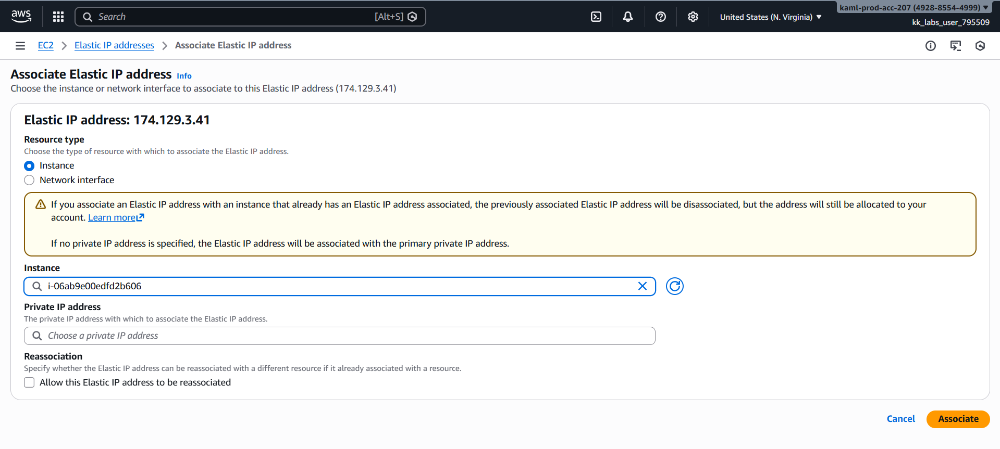  

Learnings:
Elastic IP provides a static public IPv4 address that stays the same even after the instance is stopped and started again—perfect for web servers, APIs, or any public-facing application. Combined with a proper security group (allow inbound 80/443 for web traffic and 22 for SSH), this setup gives a reliable, publicly accessible hosting environment in AWS.

### Day 22: Configuring Secure SSH Access to an EC2 Instance
Configured secure SSH access to an EC2 instance using a key pair, updated the security group to allow inbound SSH (port 22) only from my IP, and tested connection with ssh -i key.pem ec2-user@instance-public-ip.

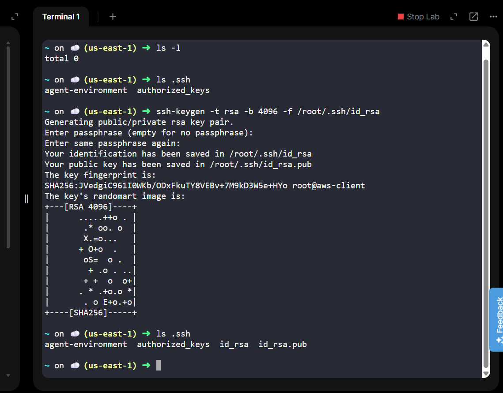   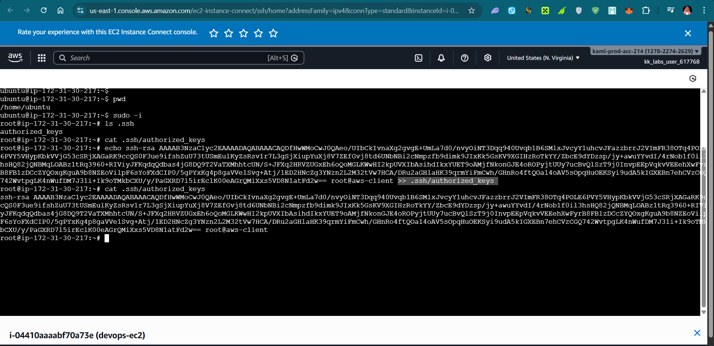 

Learnings:
Never open SSH to 0.0.0.0/0 in production. Restrict to your IP or a bastion host/VPN. Use key-based authentication (disable password login in sshd_config), keep private keys secure, and consider adding fail2ban or AWS Systems Manager Session Manager for even stronger security.

### Day 23: Data Migration Between S3 Buckets Using AWS CLI

Migrated objects from one S3 bucket to another using AWS CLI commands (e.g. aws s3 sync, aws s3 cp --recursive, or aws s3 mv).

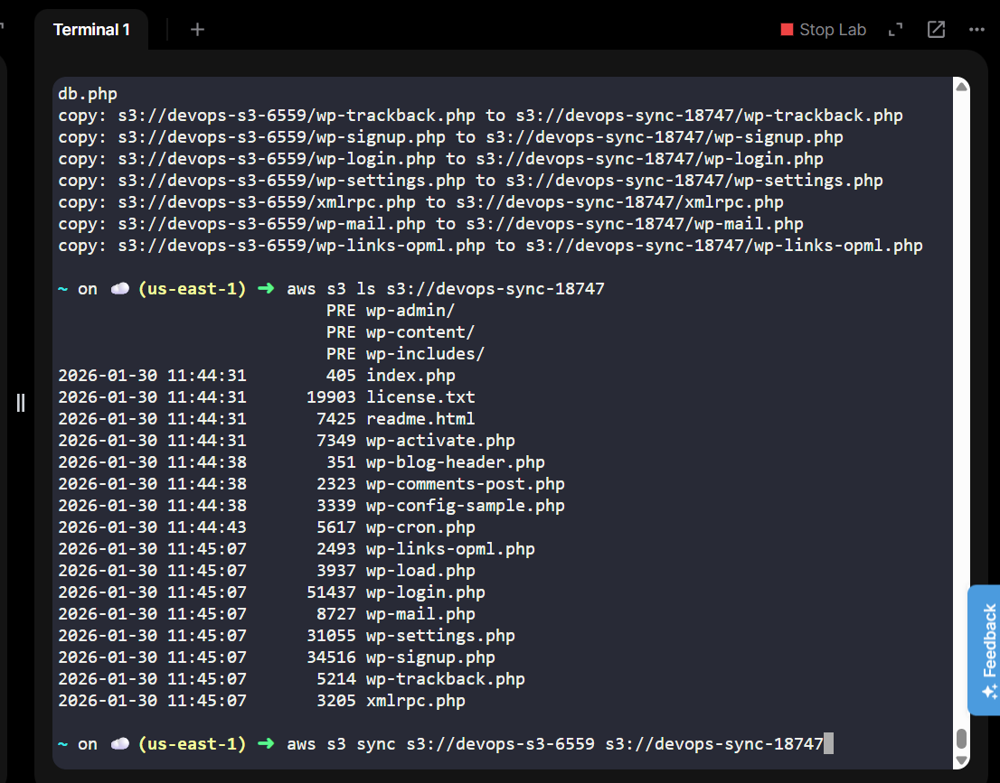   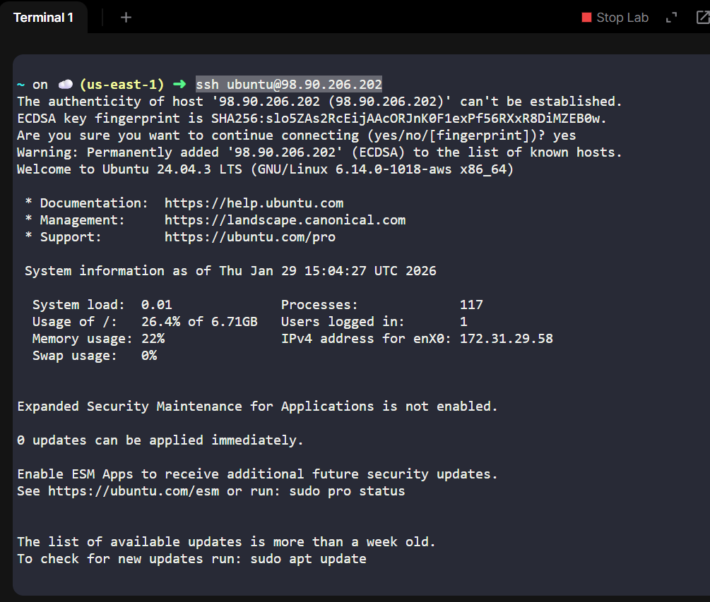

Learnings:
AWS S3 sync is powerful and efficient for mirroring buckets — it only copies changed/new files. Use --delete carefully (it removes files in the destination, not in source).

### Day 24: Setting Up an Application Load Balancer for an EC2 Instance
Created an Application Load Balancer (ALB), configured a target group with my EC2 instance, set up HTTP/HTTPS listeners, and tested traffic routing.

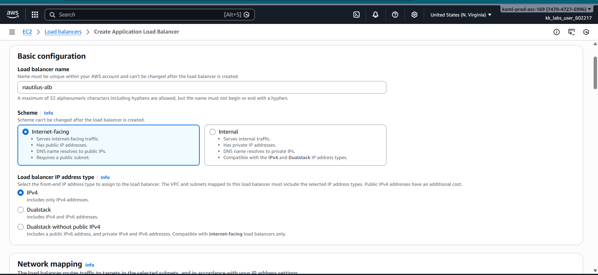

Learnings:
ALB operates at Layer 7 (HTTP/HTTPS), supports path-based/host-based routing, sticky sessions, and SSL termination. Always use a target group health check to ensure only healthy instances receive traffic. ALB + Auto Scaling Group is the standard way to make applications highly available.

### Day 25: Setting Up an EC2 Instance and CloudWatch Alarm
Launched/configured an EC2 instance and created a CloudWatch alarm ( for CPUUtilization > 90% for 5 minutes) with SNS notification.

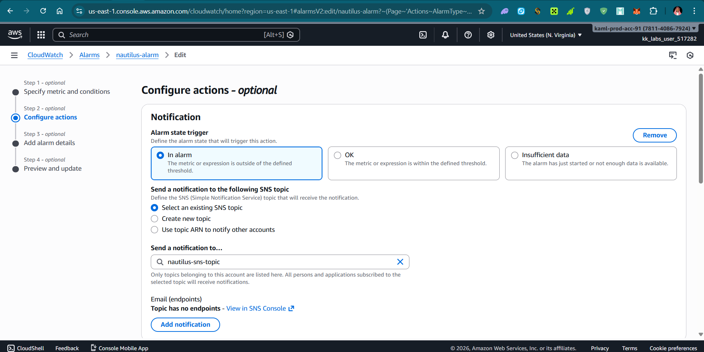   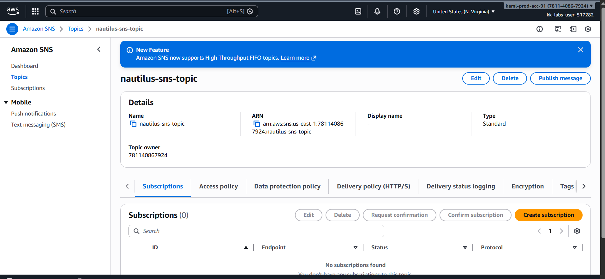 

Learnings:
CloudWatch alarms monitor metrics and trigger actions (notifications, auto-scaling, Lambda). Alarms help detect issues early — combine with notifications or auto-recovery for better resilience.

### Day 26: Configuring an EC2 Instance as a Web Server with Nginx
Launched an EC2 instance, installed and configured Nginx (sudo yum install nginx or apt install nginx), edited the default site config, started/enabled the service, and tested with curl/browser.
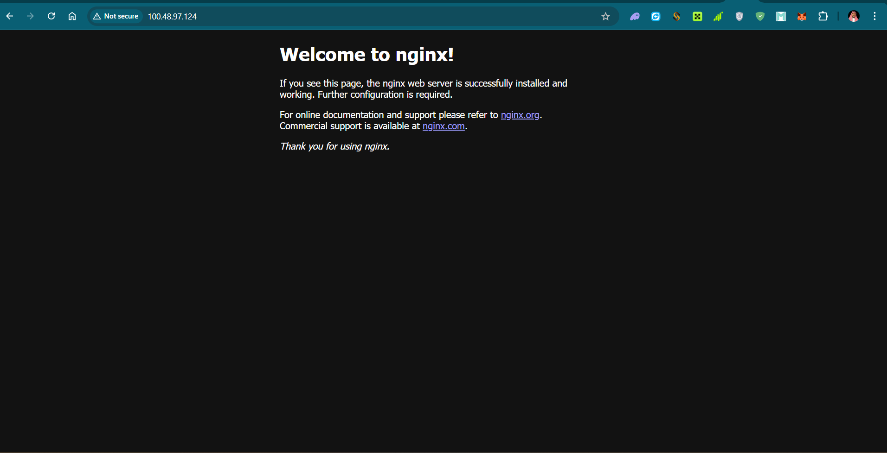   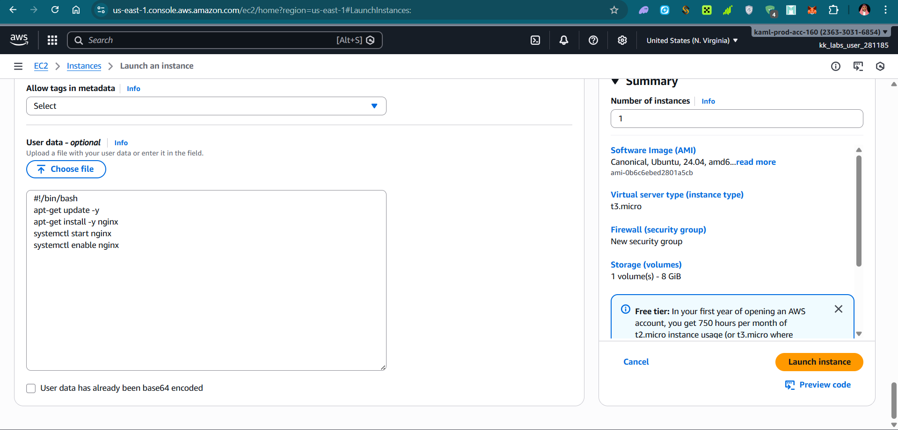

Learnings:
Nginx is lightweight, fast, and great for serving static content or as a reverse proxy. Basic steps: install → configure server block → open port 80 in security group → start service.

### Day 27: Configuring a Public VPC with an EC2 Instance for Internet Access
Created a VPC with a public subnet, Internet Gateway, route table update (0.0.0.0/0 → IGW), launched an EC2 instance in the public subnet, assigned public IP, and verified internet connectivity.
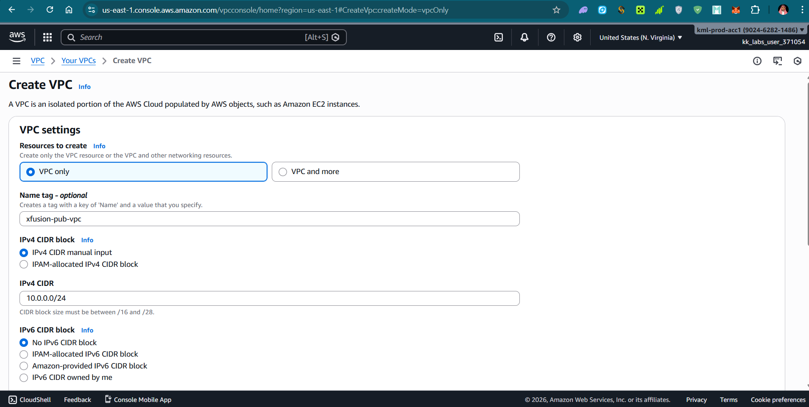   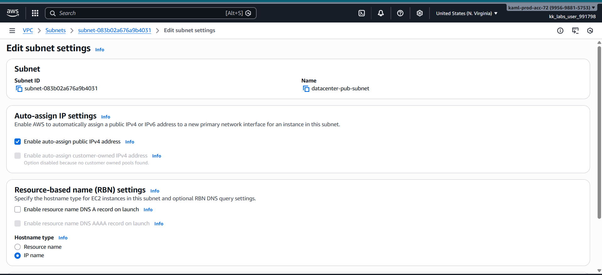 

Learnings:
For public internet access: VPC → Internet Gateway → Public Subnet → Route Table (default route to IGW) → Instance with public IP/subnet auto-assign enabled. Security group still controls inbound/outbound traffic. This is the foundation for most public-facing workloads.

### Day 28: Creating a Private ECR Repository
Created a private Amazon Elastic Container Registry (ECR) repository to store Docker images securely.
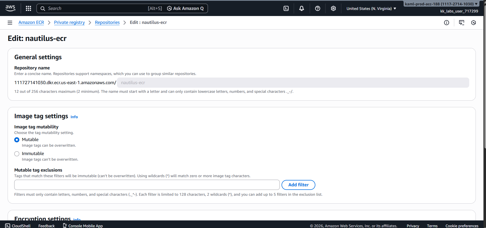

Learnings:
ECR is AWS’s private Docker registry — fully integrated with IAM for access control. Private repos are not publicly accessible. Use aws ecr get-login-password + docker login to push/pull images. Combine with ECS, EKS or Lambda container images for containerised workloads.

